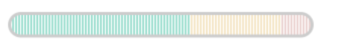
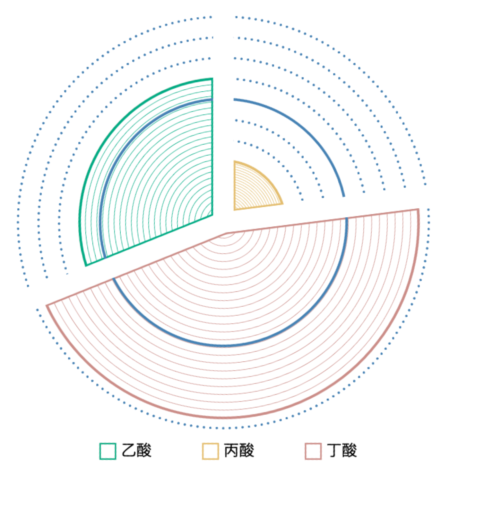

## Reports' Graphics API Referrence

this library outputs graphics with interfaces as below
* parser
* trendCompare
* pieSpiral
* arcLine
* proportion
* deviation
* curveGraph
* linkGraph
* pieStruct
* subwayRoutes
  * init
* amountHistogram
* metabolism(for the Professional)


****

#### Notifications
1. This library aims at making it purely free to transfer between data and graphics . The most common json struct is `config`, whose keys and values can be mostly customed.

2. For regular graphics ,the most is draw in svg based on Cartesian coordinate system; For irregular graphics or more geometrical, the most  is draw in canvas based on Polar coordinate system.


****

### Specs Over Configuration
1. Each graphic vue component shall be independent, for example, one ancestor dom node with one svg/canvas.

2. To be specific, `oDom` should have an `id` for the best.

3. For all texts that may contain the Greek Letters, attention should be paid on its unicode encoding transforming.

4. Each component should impor basic styles like `import 'data2graphics/basic.css'`

****

#### parser
The `parser` interface is a data-transforming tool, turn to [parser4data](https://github.com/fanyer/parser4data).


#### trendCompare()
after import this function , you can call it as below:

this domain [0,10]
```
trendCompare(oDom, config1, config2)

//oDom is a dom object

//config example
{
    "type": "textdemo",
    "data": {
        'aaa': {
            'value': 5,
            'en': 'Dietary fiber'
        },
        'bbb': {
            'en': 'Fructo-oligosaccharide',
            'value': 6.5
        },
        'ccc': {
            "en": "Isomalto-oligosaccharide",
            'value': 4
        },
        'ddd': {
            'value': 2.5,
            "en": "𝜷-glucan"
        },
        'eee': {
            'value': 4,
            "en": "Glucomammam"
        },
        'fff': {
            'value': 3,
            "en": "Resistant malyodextrins"
        }
    },
    'cnFontSize': 20,
    'enFontSize': 16
}

```
This one is draw in colors with not deterministic.

Here I set 'seagreen', 'steelblue'

It will render as below:


#### pieSpiral()
this domain [0,1], and sum=1
```
pieSpiral(oDom, config)

//config example
{
    'text': 'adad',
    'data': {
        'aaa': {
            'value': 0.08,
            'color': 'seagreen'
        },
        'bbb': {
            'value': 0.17,
            'color': 'steelblue'
        },
        'ccc': {
            'value': 0.2,
            'color': 'salmon'
        },
        'ddd': {
            'value': 0.1,
            'color': 'steelblue'
        },
        'eee': {
            'value': 0.05,
            'color': 'steelblue'
        },
        'fff': {
            'value': 0.4,
            'color': 'steelblue'
        }
    }
}
```
It will render as below:


### arcLine()
this domain [0,1]
```
arcLine(oDom, config)

//config example
 "score": 46.7,
    "data": {
        "aaa": {
            "value": 0.4,
            "en": "Fructo-oligosaccharide"
        },
        "bbb": {
            "value": 0.6,
            "en": "Isomalto-oligosaccharide"
        },
        "ccc": {
            "value": 0.3,
            "en": "𝜷-glucan"
        },
        "ddd": {
            "value": 0.2,
            "en": "Glucomammam"
        },
        "eee": {
            "value": 0.9,
            "en": "Resistant malyodextrins"
        },
        "fff": {
            "value": 0.5,
            "en": "Glucosamine"
        },
        "ggg": {
            "value": 0.3,
            "en": "Saturated fat"
        },
        "hhh": {
            "value": 0.8,
            "en": "Unsaturated fat"
        },
        "iii": {
            "value": 0.77,
            "en": "Sphingolipid"
        },
        "jjj": {
            "value": 0.12,
            "en": "Bile acid"
        },
        "lll": {
            "value": 0.34,
            "en": "Bilirubin"
        },
        "mmm": {
            "value": 0.96,
            "en": "Cholestreol"
        },
        "nnn": {
            "value": 0.43,
            "en": "Starch"
        },
        "ooo": {
            "value": 0.213,
            "en": "Dietary fiber"
        }
    }

```

It will render as below:


### proportion()
this domain anything that can produce a proportion.

```
proportion(oDom, config)

//config example
{
    'data': {
        'sature': 42,
        'unsature': 58
    },
    'text': 'adad'
}

//if text exists, it'll render text, otherwise it'll render the proportion.

```

This one is draw in colors with not deterministic.

Here I set 'seagreen', 'steelblue'

There will be 3 cases:

When the proportion is small enough 

It will render as below:


When the proportion is large enough 

It will render as below:


When the proportion is somehow normal 

It will render as below:


When text exists

It will render as below:


### deviation()
```
deviation(oDom, config)

//config example
{
  'standard':0.5,
  'data':{
    'aaa': 0.8739,
    'bbb': 0.1498,
    'ccc': 0.3483,
    'ddd': 0.5705
  }
}

```
It will render as below:


### curveGraph()
this domain [-25,25]
```
curveGraph(oDom, config)

//config example
{
  'standard': {
        'min': -25,
        '过低': [-20,-8,-7,-6,-5,-4,-3,-2,-1,0,1,2,3,4,5,6],
        '偏低': [-12,-10,-7,-6,-5,-4,-3,-2,-1,0,1,2,3,4,5,6],
        '正常': [0,8,-7,-6,-5,-4,-3,-2,-1,0,1,2,3,4,5,6],
        '偏高': [5,0,-7,-6,-5,-4,-3,-2,-1,0,1,2,3,4,5,6],
        '过高': [20,4,-7,-6,-5,-4,-3,-2,-1,0,1,2,3,4,5,6],
        'max': 25
   },
   'data': {
       'aaa': 16,
       'bbb': 19,
       'ccc': -14,
       'ddd': -5,
       'eee': -8,
       'fff': -13,
       'ggg': 6,
       'hhh': -20,
       'iii': 9,
       'jjj': -16,
       'lll': -18,
       'mmm': -7,
       'nnn': 2,
       'ooo': -7,
       'ppp': -21,
       'qqq': -7
   }
}

```
It will render as below:


### linkGraph()
this turn to [parser4data](https://pkgo.in/itg/parser4data).

```
linkGraph(oDom, config)

//config example
{
  ...   
}

```
This config is a little long, explore at [here](https://pkgo.in/itg/data2graphics/blob/master/lib/energy2.json).

It will render as below:


### pieStruct()
this domain [0,100]
```
pieStruct(oDom, config)

//config example
{
    'text': 'dadad',
    'data': {
        'aaa': {
            'en': 'adaeda',
            'value': 20
        },
        'bbb': {
            'en': '',
            'value': 25
        },
        'ccc': {
            'en': '',
            'value': 92
        },
        'ddd': {
            'en': '',
            'value': 78
        },
        'eee': {
            'en': '',
            'value': 43
        },
        'fff': {
            'en': '',
            'value': 96
        }
       
    }
}

```
It will render as below:


### subwayRoutes.init()
this turn to [parser4data](https://pkgo.in/itg/parser4data).

```
//this is exported default as an obj
import subwayRoutes from 'data2graphics'

subwayRoutes.init(oDom, config)

```
Detailed Config shows [here](https://pkgo.in/itg/data2graphics/blob/master/lib/estimate-default-config.js)


Please be prudent and precise to control the gap and x,y

It will render as below:


<!--  -->


### amountHistogram()
this domain [0,10], and sum <10
```
amountHistogram(oDom, config)

//config example
{
    "normal":7,
    "data":{
        "aaa": 9.4,
        "bbb": 0.4
    }
}

```
It will render as below:


### lineRect3()
this domain [0,1]
```
lineRect3(oDom, config)

//config example
 [
    0.5,
    0.8
]

```
It will render as below:


### lineRect5()
this domain [0,1]
```
lineRect5(oDom, config)

//config example
 [
    0.1,
    0.3,
    0.5,
    0.9
]

```
It will render as below:


### vLineRect5()
this domain [0,1]
```
vLineRect5(oDom, config)

//config example
 {
    'width':600,
    'height':80,
    'data': [
        0.2,
        0.3,
        0.4,
        0.9
    ]
 }

```
It will render as below:


### vLineRect3()
this domain [0,1]
```
vLineRect3(oDom, config)

//config example
 {
    'width':600,
    'height':50,
    'data': [
        0.2,
        0.9
    ]
}

```
It will render as below:



### metabolism()      
-------for the Professional
```
metabolism(oDom, config)

//if axisFontSize doesn't exist, default is 22

//config example
{
    "gap":[15500,18000,22000,25000],
    "axisFontSize":24,
    'indicator': {
        'value': 16000,
        'text': {
            'cn': '检测值',
            'en': 'adad'
        }
    },
    'average': {
        'value': 22000,
        'text': {
            'cn': '均值',
            'en': 'adad'
        }
    },
    "data": [{
        "x": [
            14000,
            14500
        ],
        "y": 0.0025,,
        "curve":[]   //bardata that locate in this x interval

    }, {
        "x": [
            14500,
            15000
        ],
        "y": 0.003,
        "curve":[]
    }, 
    ...
   {
        "x": [
            28000,
            28500
        ],
        "y": 0.003,
        "curve":[]
    }]
}

```
It will render as below:


### boomPie()
this domain [0,1]

```

```

It will render as below:




## How to join development?
You'd better have experience in tools and knowledges as below:
* 2 versions packaged by rollup/webpack
* process monitored by webpack
* Coordinate System in Geometry
* Distributions in Math
* fitting and approching curve functions in Math and Statistics


### FAQ
#### 1. Q: how to configure font-family in canvas or svg?

   **A**: In canvas, fonts render in the thread of canvas on GPUs. As a result, it behaves totally different from odinary html or svg in the renderer thread. You'd better preload 3rd fonts at ahead.

   for example:
   ```
    @font-face {
        font-family: adad;
        src: url("/lib/fonts/NotoSans-Regular.ttf");
    }
   ```

   **Included or required by js bundler like webpack are not valid.**

   **When the canvas context resizes ,it also transfers to the default browser settings**
