## Reports' Graphics API Referrence

this library outputs graphics with interfaces as below
* parser
* intakeSugarDistribution
* intakeFiberStruct
* scoreLevel
* intakeFatDsitribution
  * intakeFatProportion
  * intakeFatDeviation
* guideGoodness
  * curveGraph
  * linkGraph
* estimateFiber
* estimateAntibiotics
  * init
  * topLeft
  * topRight
  * bottomRight
  * bottomLeft
  * index
* amountBile
* metabolism(for the Professional)


****

#### Notifications
1. This library aims at making it purely free to transfer between data and graphics . The most common json struct is `config`, whose keys and values can be mostly customed.

2. For regular graphics ,the most is draw in svg based on Cartesian coordinate system; For irregular graphics or more geometrical, the most  is draw in canvas based on Polar coordinate system.


****

### Specs Over Configuration
1. Each graphic vue component shall be independent, for example, one ancestor dom node with one svg/canvas.

2. To be specific, `oDom` should have an `id` for the best.

3. For all texts that may contain the Greek Letters, attention should be paid on its unicode encoding transforming.

4. Each component should impor basic styles like `import 'data2graphics/basic.css'`

****

#### parser
The `parser` interface is a data-transforming tool, turn to [parser4data](https://pkgo.in/itg/parser4data).


#### intakeSugarDistribution()
after import this function , you can call it as below:

this domain [0,10]
```
intakeSugarDistribution(oDom, config1, config2)

//oDom is a dom object

//config1 example
{
    "type": "检测值",
    "data": {
        '膳食纤维': {
            'value': 5,
            'en': 'Dietary fiber'
        },
        '低聚果糖': {
            'en': 'Fructo-oligosaccharide',
            'value': 6.5
        },
        '低聚异麦芽糖': {
            "en": "Isomalto-oligosaccharide",
            'value': 4
        },
        'ß-葡萄糖': {
            'value': 2.5,
            "en": "𝜷-glucan"
        },
        '葡甘露聚糖': {
            'value': 4,
            "en": "Glucomammam"
        },
        '抗性麦芽糊精': {
            'value': 3,
            "en": "Resistant malyodextrins"
        }
    },
    'cnFontSize': 20,
    'enFontSize': 16
}
//config2 example
{
    'type': '标准值',
    'data': {
        '膳食纤维': {
            'value': 3.5,
            'en': 'Dietary fiber'
        },
        '低聚果糖': {
            'en': 'Fructo-oligosaccharide',
            'value': 2.2
        },
        '低聚异麦芽糖': {
            "en": "Isomalto-oligosaccharide",
            'value': 3.2
        },
        'ß-葡萄糖': {
            'value': 6.2,
            "en": "𝜷-glucan"
        },
        '葡甘露聚糖': {
            'value': 2.7,
            "en": "Glucomammam"
        },
        '抗性麦芽糊精': {
            'value': 5.2,
            "en": "Resistant malyodextrins"
        }
    },
    'cnFontSize': 20,
    'enFontSize': 16
 }

```
This one is draw in colors with not deterministic.

Here I set 'seagreen', 'steelblue'

It will render as below:

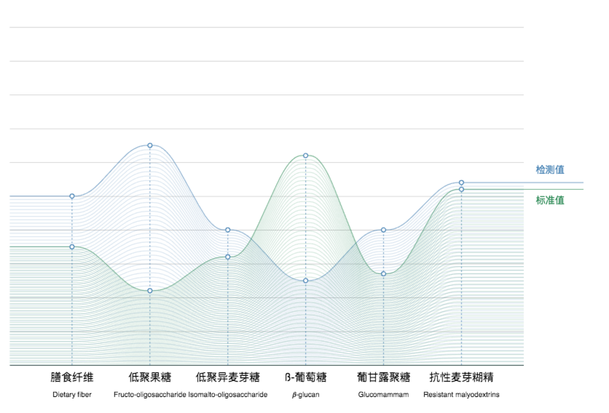


#### intakeFiberStruct()
this domain [0,1], and sum=1
```
intakeFiberStruct(oDom, config)

//config example
{
    'text': 'adad',
    'data': {
        '哒哒哒': {
            'value': 0.08,
            'color': 'seagreen'
        },
        '胆固醇': {
            'value': 0.17,
            'color': 'steelblue'
        },
        '饱和脂肪酸': {
            'value': 0.2,
            'color': 'salmon'
        },
        '不饱和脂肪酸': {
            'value': 0.1,
            'color': 'steelblue'
        },
        '谁谁脂肪酸': {
            'value': 0.05,
            'color': 'steelblue'
        },
        '鞘脂类': {
            'value': 0.4,
            'color': 'steelblue'
        }
    }
}
```
It will render as below:

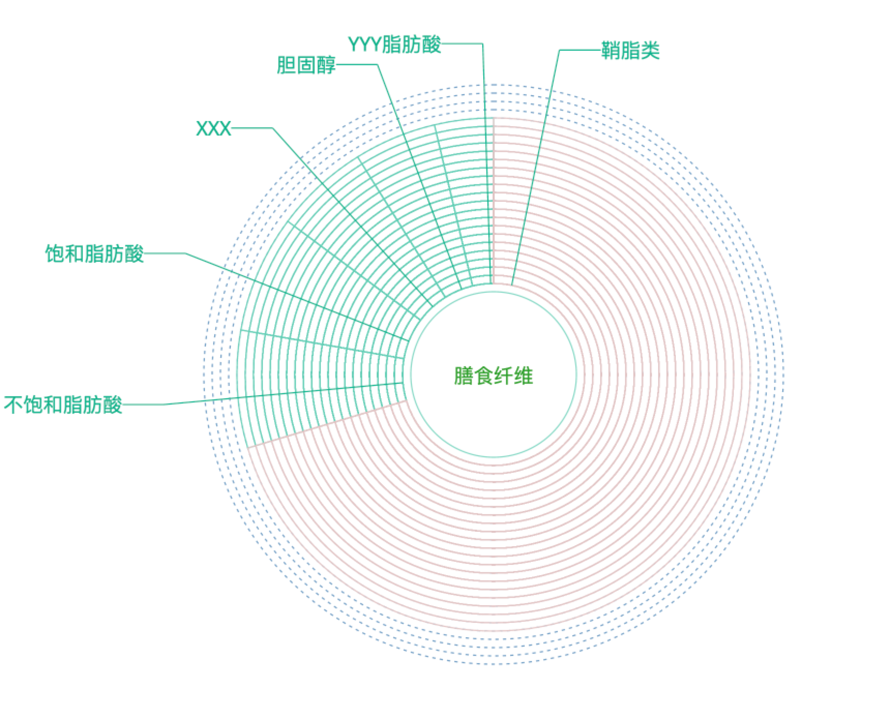


### scoreLevel()
this domain [0,1]
```
scoreLevel(oDom, config)

//config example
 "score": 46.7,
    "data": {
        "低聚果糖": {
            "value": 0.4,
            "en": "Fructo-oligosaccharide"
        },
        "低聚异麦芽糖": {
            "value": 0.6,
            "en": "Isomalto-oligosaccharide"
        },
        "𝜷-葡聚糖": {
            "value": 0.3,
            "en": "𝜷-glucan"
        },
        "葡甘露聚糖": {
            "value": 0.2,
            "en": "Glucomammam"
        },
        "抗性麦芽糊精": {
            "value": 0.9,
            "en": "Resistant malyodextrins"
        },
        "氨糖": {
            "value": 0.5,
            "en": "Glucosamine"
        },
        "饱和脂肪酸": {
            "value": 0.3,
            "en": "Saturated fat"
        },
        "不饱和脂肪酸": {
            "value": 0.8,
            "en": "Unsaturated fat"
        },
        "鞘脂类": {
            "value": 0.77,
            "en": "Sphingolipid"
        },
        "胆汁酸": {
            "value": 0.12,
            "en": "Bile acid"
        },
        "胆红素": {
            "value": 0.34,
            "en": "Bilirubin"
        },
        "胆固醇": {
            "value": 0.96,
            "en": "Cholestreol"
        },
        "淀粉": {
            "value": 0.43,
            "en": "Starch"
        },
        "膳食纤维": {
            "value": 0.213,
            "en": "Dietary fiber"
        }
    }

```

It will render as below:

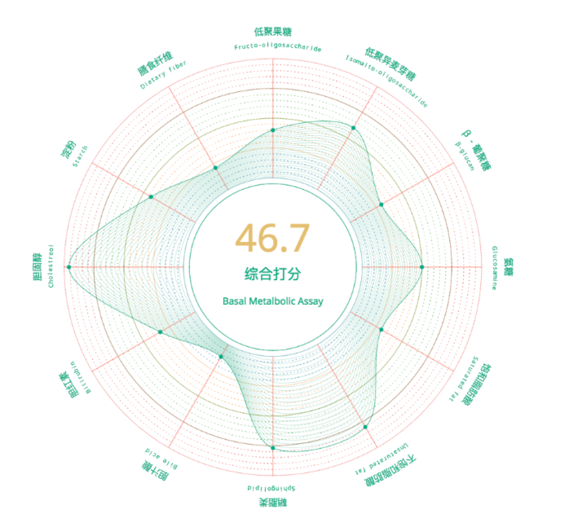


### intakeFatProportion()
this domain anything that can produce a proportion.

```
intakeFatProportion(oDom, config)

//config example
{
    'data': {
        'sature': 42,
        'unsature': 58
    },
    'text': 'adad'
}

//if text exists, it'll render text, otherwise it'll render the proportion.

```

This one is draw in colors with not deterministic.

Here I set 'seagreen', 'steelblue'

There will be 3 cases:

When the proportion is small enough 

It will render as below:

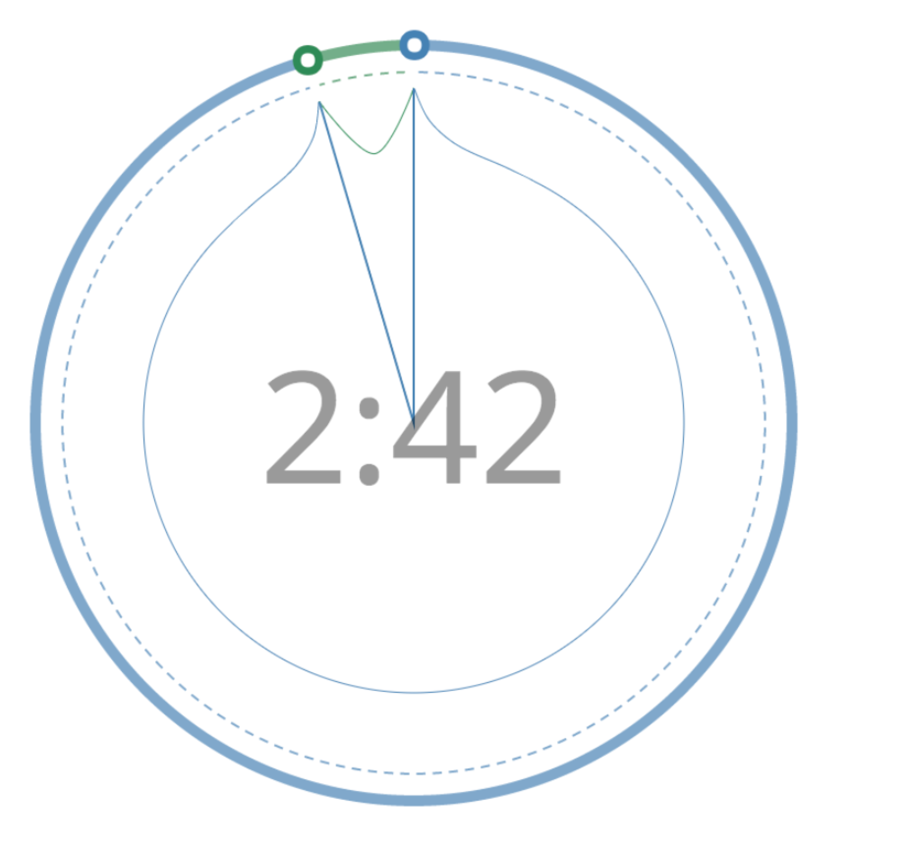

When the proportion is large enough 

It will render as below:

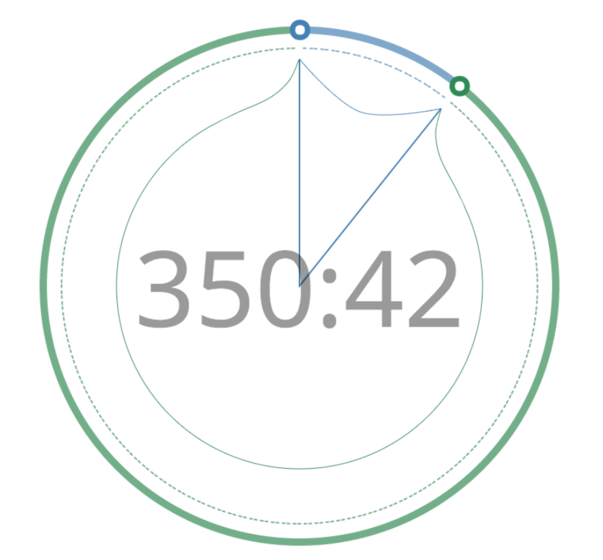

When the proportion is somehow normal 

It will render as below:

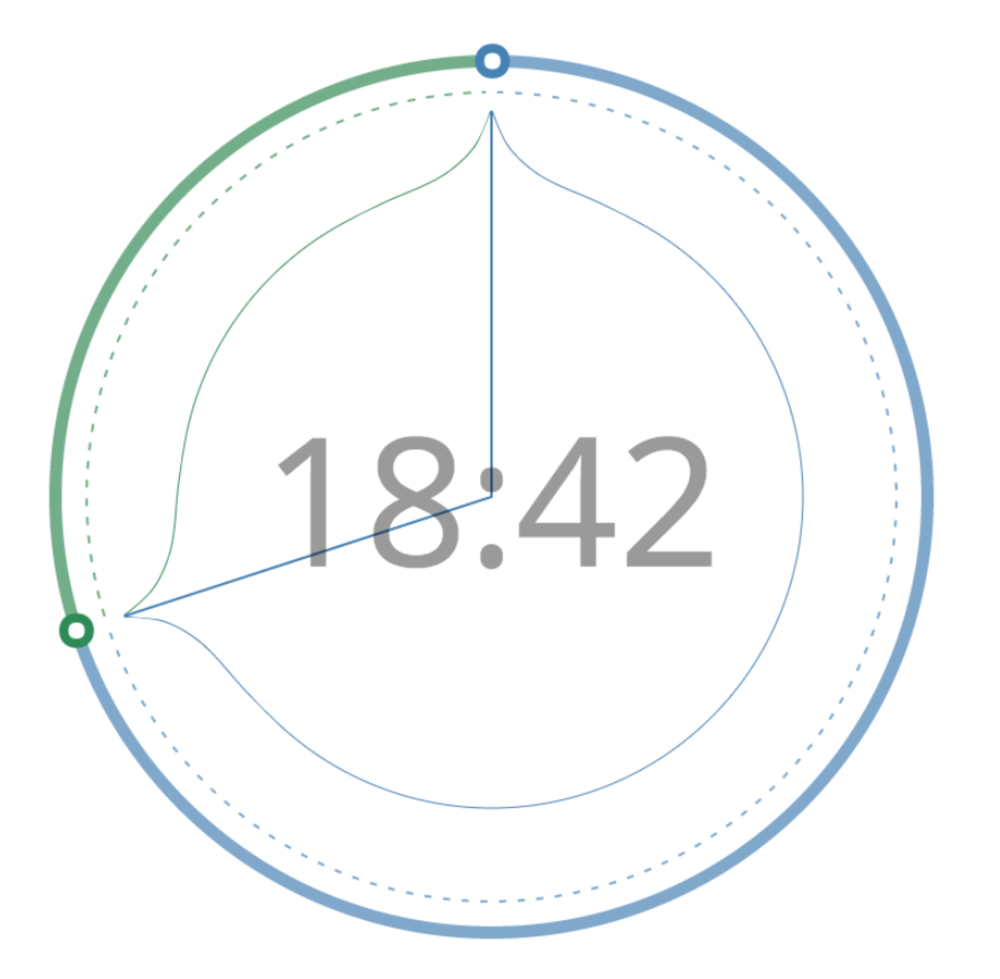

When text exists

It will render as below:

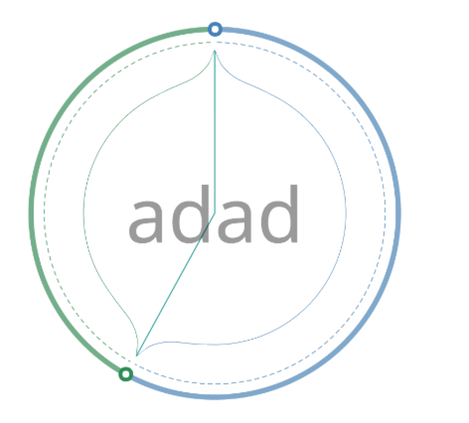


### intakeFatDeviation()
```
intakeFatDeviation(oDom, config)

//config example
{
  '标准值':0.5,
  'data':{
    '饱和脂肪酸': 0.8739,
    '不饱和脂肪酸': 0.1498,
    '鞘脂类': 0.3483,
    '胆固醇': 0.5705
  }
}

```
It will render as below:

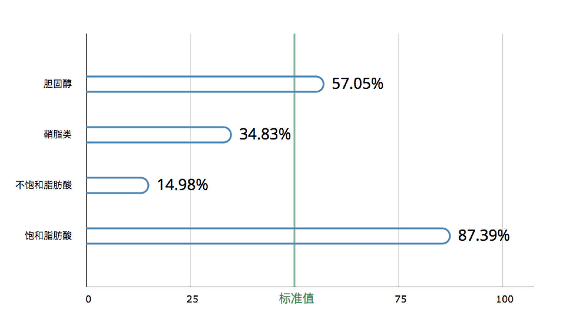


### curveGraph()
this domain [-25,25]
```
curveGraph(oDom, config)

//config example
{
  'standard': {
       'min': -25,
       '过低': -20,
       '偏低': -10,
       '正常': 0,
       '偏高': 10,
       '过高': 20,
       'max': 25
   },
   'data': {
       '维生素A': 16,
       '维生素B1': 19,
       '维生素B2': -14,
       '维生素B3': -5,
       '维生素B5': -8,
       '维生素B6': -13,
       '维生素B7': 6,
       '维生素B9': -20,
       '维生素B12': 9,
       '维生素C': -16,
       '胡萝卜素': -18,
       '维生素E': -7,
       '牛磺酸': 2,
       '辅酶Q': -7,
       '异黄酮': -21,
       '维生素K': -7
   }
}

```
It will render as below:

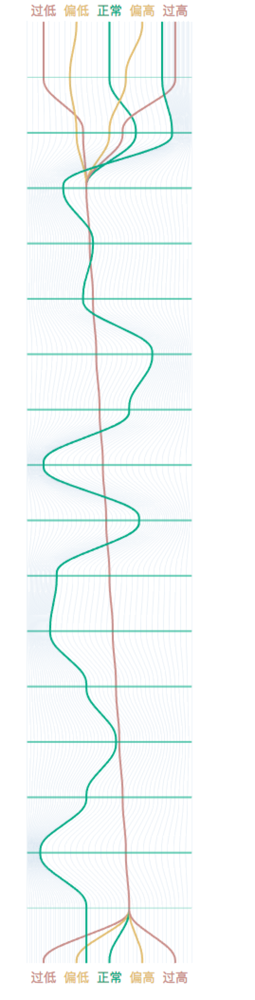


### linkGraph()
this turn to [parser4data](https://pkgo.in/itg/parser4data).

```
linkGraph(oDom, config)

//config example
{
  ...   
}

```
This config is a little long, explore at [here](https://pkgo.in/itg/data2graphics/blob/master/lib/energy2.json).

It will render as below:

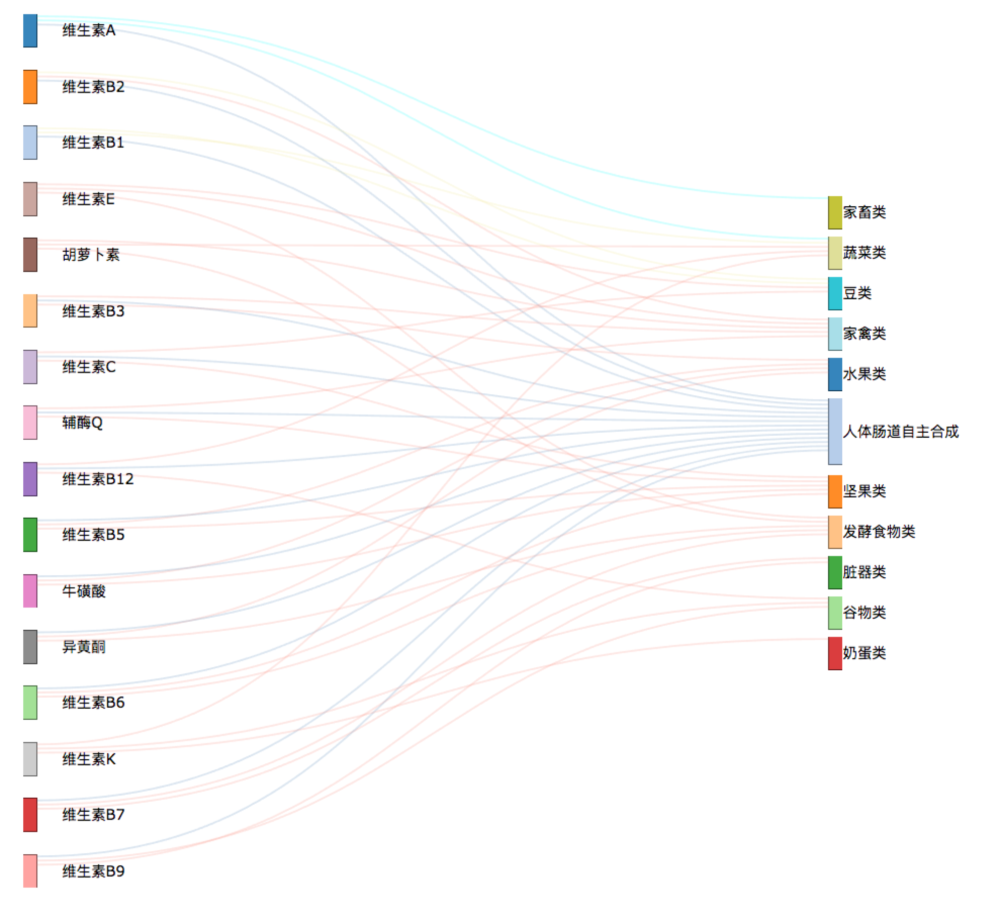


### estimateFiber()
this domain [0,100]
```
estimateFiber(oDom, config)

//config example
{
    'text': 'dadad',
    'data': {
        '维生素a': {
            'en': 'adaeda',
            'value': 20
        },
        '维生素b': {
            'en': '',
            'value': 25
        },
        '维生素c': {
            'en': '',
            'value': 92
        },
        '维生素d': {
            'en': '',
            'value': 78
        },
        '维生素e': {
            'en': '',
            'value': 43
        },
        '维生素f': {
            'en': '',
            'value': 96
        },
        '维生素g': {
            'en': '',
            'value': 32
        },
        '维生素h': {
            'en': '',
            'value': 79
        },
        '维生素i': {
            'en': '',
            'value': 82
        },
        '维生素j': {
            'en': '',
            'value': 45
        },
        '维生素k': {
            'en': '',
            'value': 53
        },
        '维生素l': {
            'en': '',
            'value': 98
        },
        '维生素m': {
            'en': '',
            'value': 92
        },
        '维生素n': {
            'en': '',
            'value': 48
        },
        '维生素o': {
            'en': '',
            'value': 84
        },
        '维生素p': {
            'en': '',
            'value': 92
        }
    }
}

```
It will render as below:

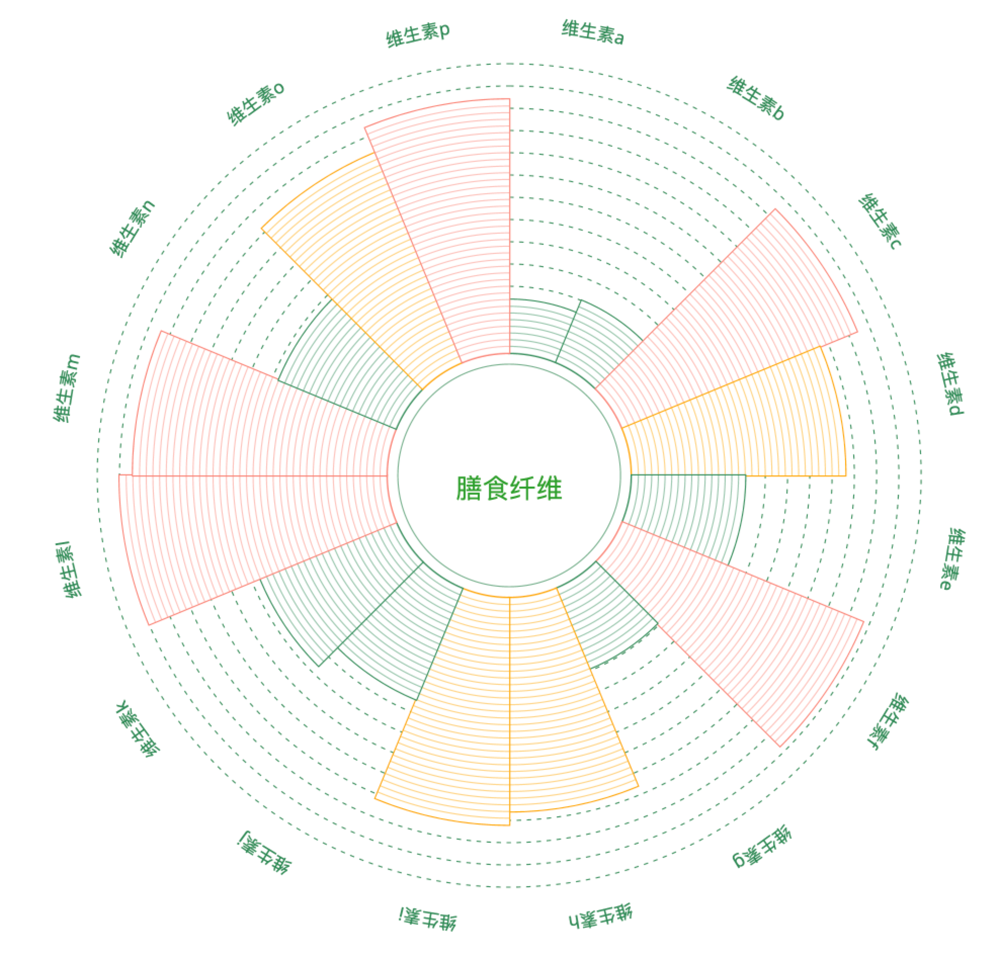

### estimateAntibiotics.init()
this turn to [parser4data](https://pkgo.in/itg/parser4data).

```
//this is exported default as an obj
import estimateAntibiotics from 'data2graphics'

estimateAntibiotics.init(oDom, config)

```
Detailed Config shows [here](https://pkgo.in/itg/data2graphics/blob/master/lib/estimate-default-config.js)


Please be prudent and precise to control the gap and x,y

It will render as below:

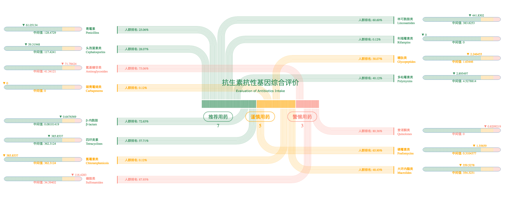


<!-- 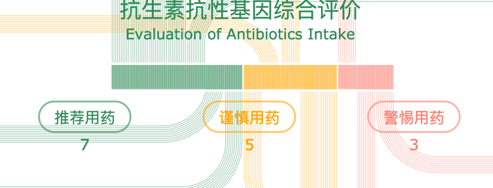 -->


### amountBile()
this domain [0,10], and sum <10
```
amountBile(oDom, config)

//config example
{
  "bileAcid":6,
  "cholesterol":2
}

```
It will render as below:

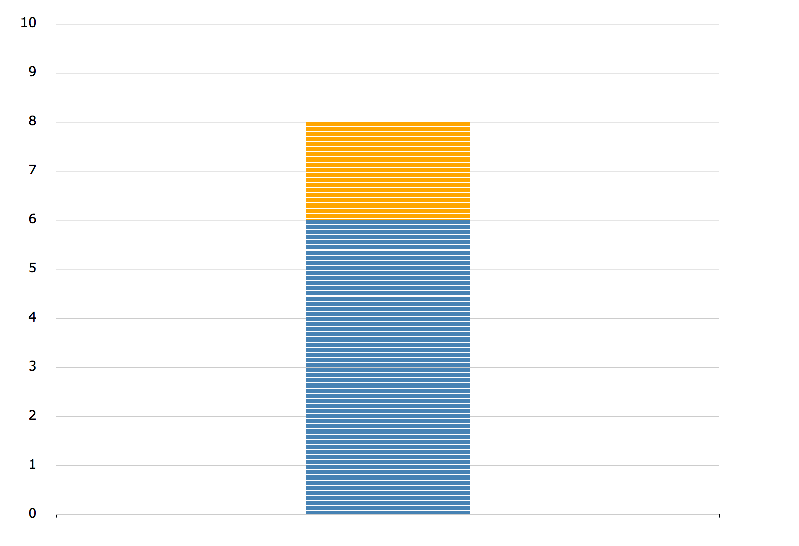

### lineRect3()
this domain [0,1]
```
lineRect3(oDom, config)

//config example
 [
    0.5,
    0.8
]

```
It will render as below:

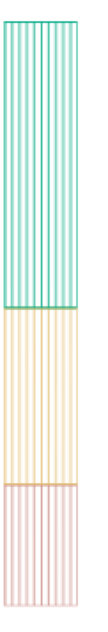

### lineRect5()
this domain [0,1]
```
lineRect3(oDom, config)

//config example
 [
    0.1,
    0.3,
    0.5,
    0.9
]

```
It will render as below:

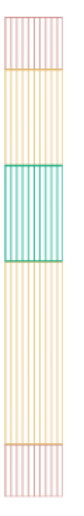
### vLineRect5()
this domain [0,1]
```
vLineRect5(oDom, config)

//config example
 [
    0.1,
    0.3,
    0.5,
    0.9
]

```
It will render as below:

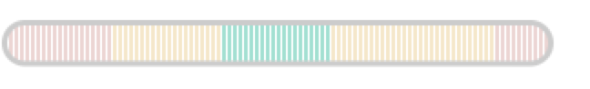

### metabolism()      
-------for the Professional
```
metabolism(oDom, config)

//if axisFontSize doesn't exist, default is 22

//config example
{
    "gap":[15500,18000,22000,25000],
    "axisFontSize":24,
    'indicator': {
        'value': 16000,
        'text': {
            'cn': '检测值',
            'en': 'adad'
        }
    },
    'average': {
        'value': 22000,
        'text': {
            'cn': '均值',
            'en': 'adad'
        }
    },
    "data": [{
        "x": [
            14000,
            14500
        ],
        "y": 0.0025,,
        "curve":[]   //bardata that locate in this x interval

    }, {
        "x": [
            14500,
            15000
        ],
        "y": 0.003,
        "curve":[]
    }, {
        "x": [
            15000,
            15500
        ],
        "y": 0.0038,
        "curve":[]
    }, {
        "x": [
            15500,
            16000
        ],
        "y": 0.01,
        "curve":[]
    }, {
        "x": [
            16000,
            16500
        ],
        "y": 0.018,
        "curve":[]
    }, {
        "x": [
            16500,
            17000
        ],
        "y": 0.03,
        "curve":[]
    }, {
        "x": [
            17000,
            17500
        ],
        "y": 0.015,
        "curve":[]
    }, {
        "x": [
            17500,
            18000
        ],
        "y": 0.026,
        "curve":[]
    }, {
        "x": [
            18000,
            18500
        ],
        "y": 0.026,
        "curve":[]
    }, {
        "x": [
            18500,
            19000
        ],
        "y": 0.034,
        "curve":[]
    }, {
        "x": [
            19000,
            19500
        ],
        "y": 0.05,
        "curve":[]
    }, {
        "x": [
            19500,
            20000
        ],
        "y": 0.05,
        "curve":[]
    }, {
        "x": [
            20000,
            20500
        ],
        "y": 0.07,
        "curve":[]
    }, {
        "x": [
            20500,
            21000
        ],
        "y": 0.078,
        "curve":[]
    }, {
        "x": [
            21000,
            21500
        ],
        "y": 0.083,
        "curve":[]
    }, {
        "x": [
            21500,
            22000
        ],
        "y": 0.072,
        "curve":[]
    }, {
        "x": [
            22000,
            22500
        ],
        "y": 0.08,
        "curve":[]
    }, {
        "x": [
            22500,
            23000
        ],
        "y": 0.078,
        "curve":[]
    }, {
        "x": [
            23000,
            23500
        ],
        "y": 0.075,
        "curve":[]
    }, {
        "x": [
            23500,
            24000
        ],
        "y": 0.075,
        "curve":[]
    }, {
        "x": [
            24000,
            24500
        ],
        "y": 0.056,
        "curve":[]
    }, {
        "x": [
            24500,
            25000
        ],
        "y": 0.059,
        "curve":[]
    }, {
        "x": [
            25000,
            25500
        ],
        "y": 0.043,
        "curve":[]
    }, {
        "x": [
            25500,
            26000
        ],
        "y": 0.037,
        "curve":[]
    }, {
        "x": [
            26000,
            26500
        ],
        "y": 0.028,
        "curve":[]
    }, {
        "x": [
            26500,
            27000
        ],
        "y": 0.018,
        "curve":[]
    }, {
        "x": [
            27000,
            27500
        ],
        "y": 0.012,
        "curve":[]
    }, {
        "x": [
            27500,
            28000
        ],
        "y": 0.01,
        "curve":[]
    }, {
        "x": [
            28000,
            28500
        ],
        "y": 0.003,
        "curve":[]
    }]
}

```
It will render as below:

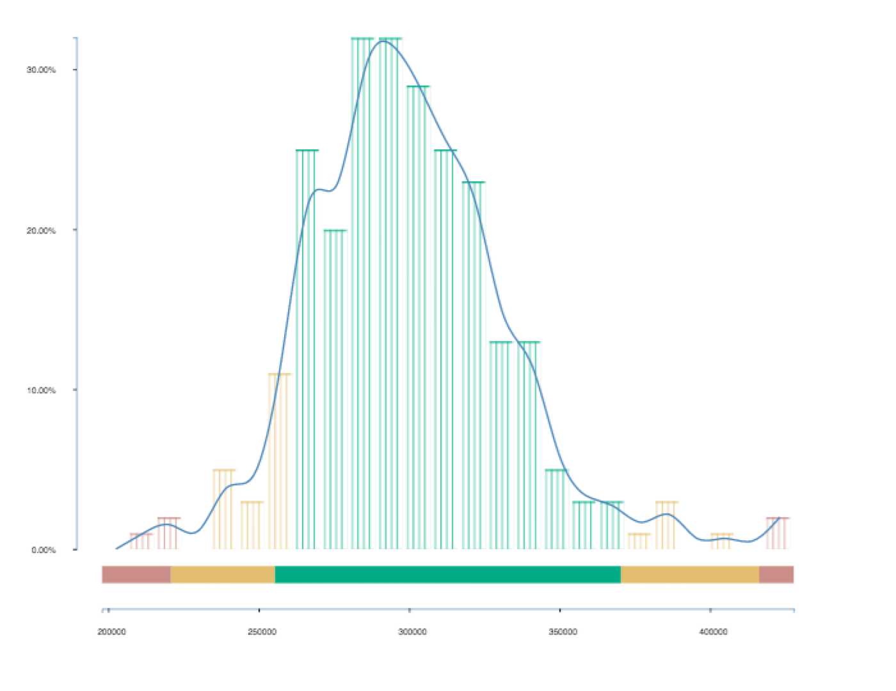


## How to join development?
You'd better have experience in tools and knowledges as below:
* 2 versions packaged by rollup/webpack
* process monitored by webpack
* Coordinate System in Geometry
* Distributions in Math
* fitting and approching curve functions in Math and Statistics


### FAQ
#### 1. Q: how to configure font-family in canvas or svg?

   **A**: In canvas, fonts render in the thread of canvas on GPUs. As a result, it behaves totally different from odinary html or svg in the renderer thread. You'd better preload 3rd fonts at ahead.

   for example:
   ```
    @font-face {
        font-family: adad;
        src: url("/lib/fonts/NotoSans-Regular.ttf");
    }
   ```

   **Included or required by js bundler like webpack are not valid.**

   **When the canvas context resizes ,it also transfers to the default browser settings**
