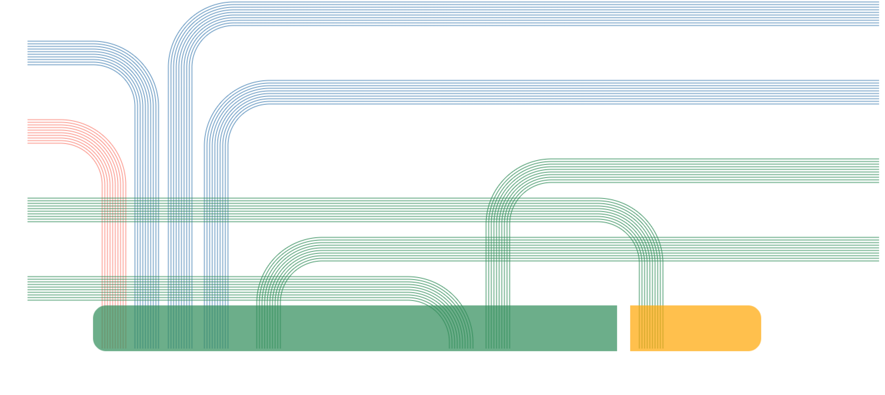

## Reports' Graphics API Referrence

this library outputs graphics with interfaces as below
* parser
* intakeSugarDistribution
* intakeFiberStruct
* scoreLevel
* intakeFatDsitribution
  * intakeFatProportion
  * intakeFatDeviation
* guideGoodness
  * curveGraph
  * linkGraph
* estimateFiber
* estimateAntibiotics
  * init
  * topLeft
  * topRight
  * bottomRight
  * bottomLeft
  * index
* amountBile
* metabolism(for the Professional)


****

#### Notifications
1. This library aims at making it purely free to transfer between data and graphics . The most common json struct is `config`, whose keys and values can be mostly customed.

2. For regular graphics ,the most is draw in svg based on Cartesian coordinate system; For irregular graphics or more geometrical, the most  is draw in canvas based on Polar coordinate system.


****

### Specs Over Configuration
1. Each graphic vue component shall be independent, for example, one ancestor dom node with one svg/canvas.

2. To be specific, `oDom` should have an `id` for the best.

3. For all texts that may contain the Greek Letters, attention should be paid on its unicode encoding transforming.

****

#### parser
The `parser` interface is a data-transforming tool, docs [here](./parser/README.md).


#### intakeSugarDistribution()
after import this function , you can call it as below:
```
intakeDistribution(oDom, config1, config2)

//oDom is a dom object

//config1 example
{
  'type': '检测值',
  'data': {
      '膳食纤维': 5,
      '低聚果糖': 6.5,
      '低聚异麦芽糖': 4,
      'ß-葡萄糖': 2.5,
      '葡甘露聚糖': 4,
      '抗性麦芽糊精': 3
   }
}
//config2 example
{
   'type': '标准值',
   'data': {
       '膳食纤维': 3.5,
       '低聚果糖': 2.2,
       '低聚异麦芽糖': 3.2,
       'ß-葡萄糖': 6.2,
       '葡甘露聚糖': 2.7,
       '抗性麦芽糊精': 5.2
   }
 }

```
It will render as below:


#### intakeFiberStruct()
```
intakeFiberStruct(oDom, config)

//config example
{
   'XXX': 0.08,
   '胆固醇': 0.17,
   '饱和脂肪酸': 0.2,
   '不饱和脂肪酸': 0.1,
   'YYY脂肪酸': 0.05,
   '鞘脂类': 0.4
}
```
It will render as below:


### scoreLevel()
```
scoreLevel(oDom, config)

//config example
 "score": 46.7,
    "data": {
        "低聚果糖": {
            "value": 0.4,
            "en": "Fructo-oligosaccharide"
        },
        "低聚异麦芽糖": {
            "value": 0.6,
            "en": "Isomalto-oligosaccharide"
        },
        "𝜷-葡聚糖": {
            "value": 0.3,
            "en": "𝜷-glucan"
        },
        "葡甘露聚糖": {
            "value": 0.2,
            "en": "Glucomammam"
        },
        "抗性麦芽糊精": {
            "value": 0.9,
            "en": "Resistant malyodextrins"
        },
        "氨糖": {
            "value": 0.5,
            "en": "Glucosamine"
        },
        "饱和脂肪酸": {
            "value": 0.3,
            "en": "Saturated fat"
        },
        "不饱和脂肪酸": {
            "value": 0.8,
            "en": "Unsaturated fat"
        },
        "鞘脂类": {
            "value": 0.77,
            "en": "Sphingolipid"
        },
        "胆汁酸": {
            "value": 0.12,
            "en": "Bile acid"
        },
        "胆红素": {
            "value": 0.34,
            "en": "Bilirubin"
        },
        "胆固醇": {
            "value": 0.96,
            "en": "Cholestreol"
        },
        "淀粉": {
            "value": 0.43,
            "en": "Starch"
        },
        "膳食纤维": {
            "value": 0.213,
            "en": "Dietary fiber"
        }
    }

```

It will render as below:


### intakeFatProportion()
```
intakeFatProportion(oDom, config)

//config example
{
  'sature': 42,
  'unsature': 58
}

```
There will be 2 cases:

When the proportion is small enough 

It will render as below:


When the proportion is somehow normal 

It will render as below:


### intakeFatDeviation()
```
intakeFatDeviation(oDom, config)

//config example
{
  '标准值':0.5,
  'data':{
    '饱和脂肪酸': 0.8739,
    '不饱和脂肪酸': 0.1498,
    '鞘脂类': 0.3483,
    '胆固醇': 0.5705
  }
}

```
It will render as below:


### curveGraph()
```
curveGraph(oDom, config)

//config example
{
  'standard': {
       'min': -25,
       '过低': -20,
       '偏低': -10,
       '正常': 0,
       '偏高': 10,
       '过高': 20,
       'max': 25
   },
   'data': {
       '维生素A': 16,
       '维生素B1': 19,
       '维生素B2': -14,
       '维生素B3': -5,
       '维生素B5': -8,
       '维生素B6': -13,
       '维生素B7': 6,
       '维生素B9': -20,
       '维生素B12': 9,
       '维生素C': -16,
       '胡萝卜素': -18,
       '维生素E': -7,
       '牛磺酸': 2,
       '辅酶Q': -7,
       '异黄酮': -21,
       '维生素K': -7
   }
}

```
It will render as below:


### linkGraph()
```
linkGraph(oDom, config)

//config example
{
  ...   
}

```
This config is a little long, explore at [here](https://pkgo.in/itg/data2graphics/blob/master/lib/energy2.json).

It will render as below:


### estimateFiber()
```
estimateFiber(oDom, config)

//config example
{
   '维生素a': 1,
   '维生素b': 1,
   '维生素c': 3,
   '维生素d': 2,
   '维生素e': 1,
   '维生素f': 3,
   '维生素g': 1,
   '维生素h': 2,
   '维生素i': 2,
   '维生素j': 1,
   '维生素k': 1,
   '维生素l': 3,
   '维生素m': 3,
   '维生素n': 1,
   '维生素o': 2,
   '维生素p': 3
}

```
It will render as below:


### estimateAntibiotics.init()
```
//this is exported default as an obj
import estimateAntibiotics from 'data2graphics'

estimateAntibiotics.init(oDom, config)

//advanced config example, and this can allow disoder in arr
{
  top: [{
        x: -7,
        y: 5,
        color: '',
        tag: {
           cn: '头孢菌素类',
           en: 'Cephalosporins'
       },
       data: {
           rank: 0.2807,
           median: 117.4241,
           absolute: 59.31948
       },
        direction: 'left'
    }, ... , {

        x: 5,
        y: 3,
        color: '',
        tag: {
           cn: '青霉素',
           en: 'Penicillins'
       },
       data: {
           rank: 0.2506,
           median: 128.4729,
           absolute: 61.05134
       },
        direction: 'left'
    }],
    bottom: [{
        x: -2,
        y: 1,
        color: '',
        tag: {
           cn: '青霉素',
           en: 'Penicillins'
       },
       data: {
           rank: 0.2506,
           median: 128.4729,
           absolute: 61.05134
       },
        direction: 'left'
    }, ... , {
        x: 7,
        y: 2,
        color: 'orange',
        tag: {
           cn: '青霉素',
           en: 'Penicillins'
       },
       data: {
           rank: 0.2506,
           median: 128.4729,
           absolute: 61.05134
       },
        direction: 'right'
    }],
    gap: [3, 6] //gap is the x value of central orange range's start & end and the end should be greater than the start.
}


//for simplified usage, this set default order in array, and remove x ,y , direction keys.
{
  color: 'orange',
  tag: {
     cn: '青霉素',
     en: 'Penicillins'
 },
 data: {
     rank: 0.2506,
     median: 128.4729,
     absolute: 61.05134
 }
}

```
Detailed Config shows [here](https://pkgo.in/itg/data2graphics/blob/master/lib/estimate-default-config.js)


Please be prudent and precise to control the gap and x,y

It will render as below:





### amountBile()
```
amountBile(oDom, config)

//config example
{
  "bileAcid":6,
  "cholesterol":2
}

```
It will render as below:


### metabolism()      
-------for the Professional
```
metabolism(oDom, config)

//config example
{

}

```
It will render as below:


## How to join development?
You'd better have experience in tools and knowledges as below:
* 2 versions packaged by rollup/webpack
* process monitored by webpack
* Coordinate System in Geometry
* Distributions in Math
* fitting and approching curve functions in Math and Statistics


### FAQ
#### 1. Q: how to configure font-family in canvas or svg?

   **A**: In canvas, fonts render in the thread of canvas on GPUs. As a result, it behaves totally different from odinary html or svg in the renderer thread. You'd better preload 3rd fonts at ahead.

   **Included or required by js bundler like webpack are not valid.**

   **When the canvas context resizes ,it also transfers to the default browser settings**
